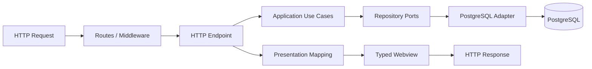
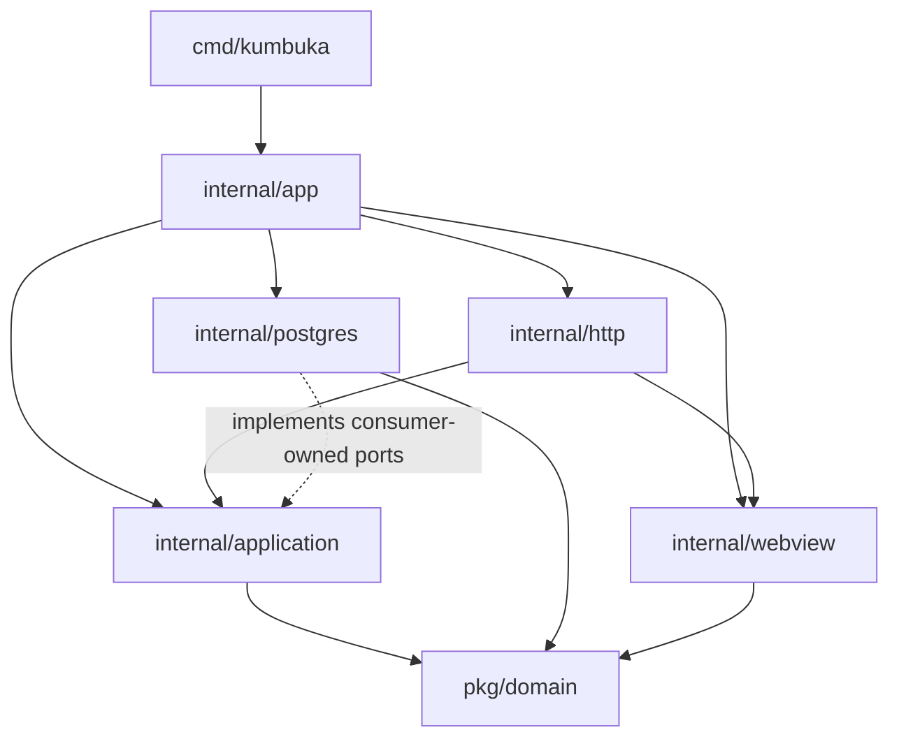
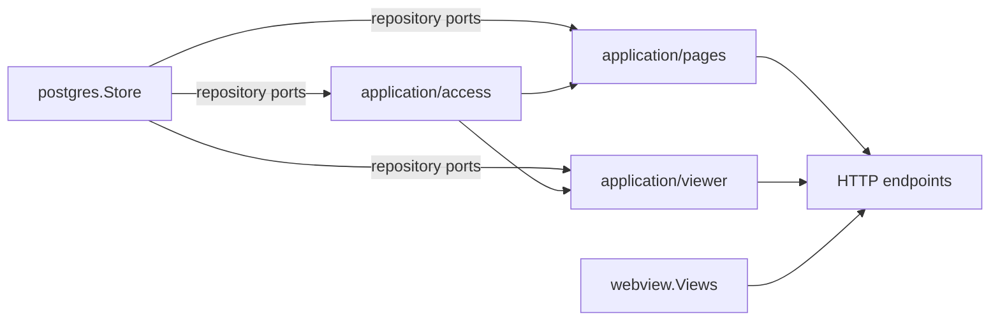

# Architecture

Kumbuka is a modular Go monolith. HTTP is the request orchestration boundary, application packages own use cases, narrow consumer-owned repository interfaces describe persistence needs, PostgreSQL implements those interfaces, and `internal/webview` renders already-prepared typed presentation models.



## Dependency direction

The dependency direction is inward toward application policy and outward only through interfaces owned by their consumers.



`internal/app/run.go` is the process composition root and the only Go source file in `internal/app`. It is allowed to know concrete adapters because its job is construction, lifecycle sequencing, and wiring. Application packages must not import `net/http`, `html/template`, the HTTP adapter, webview, or PostgreSQL packages. Webview must not import application, HTTP-adapter, or PostgreSQL packages. PostgreSQL owns `pgx` and SQL persistence code.

## HTTP adapter

`internal/http` owns transport concerns: routes, route/query/form parameters, cookies, authentication middleware, coarse role checks, status mapping, redirects, and response selection. A normal request has one orchestration boundary: the endpoint. The endpoint resolves the actor and request input, invokes application use cases, loads the shared browser context when needed, maps results into a typed webview model, and renders the response.

Resource authorization does not belong in route middleware. Middleware may enforce coarse policies such as authenticated, administrator, or editor. Page-specific checks such as view/edit permission are performed by application use cases.

## Application use cases

`internal/application` is grouped by capability rather than by transport or database table. Queries read and commands mutate, but there is no command bus, query bus, mediator, generic repository, or dependency-injection framework. Page work is split into focused lookup, search, directory, reporting, personal, history, mutation, presence, discussion, review, and bulk capabilities rather than one general-purpose page service.

Repository interfaces live next to the application code that consumes them. They expose only the persistence operations required by that capability. Application errors remain independent of HTTP and are translated by endpoints. Concrete Markdown rendering, icon catalogs, secret encryption, and password hashing are supplied through narrow application-owned capabilities; `internal/pagecontent` adapts the Markdown renderer for persisted page artifacts while the composition root supplies the concrete security adapters.

`internal/application/viewer` is the shared authenticated browser-context query. It loads only data genuinely shared by the browser shell, including preferences, authorized navigation inputs, settings required by the shell, saved searches, and notifications. Page-specific data remains in page-specific use cases.

## PostgreSQL adapter

`internal/postgres` is the persistence adapter. A single concrete store may implement many narrow application repository interfaces. SQL and `pgx` stay in this package; application code never depends on `*postgres.Store`.

Inherited page access has both single-resource and bulk operations. Collection paths use `PageAccessBatch`, allowing navigation and other page collections to authorize a whole set in a bounded number of database round trips rather than issuing one access query per page.

## Web presentation

`internal/webview` is passive. It does not fetch application data, perform authorization lookups, or access PostgreSQL. Templates receive typed screen models that embed the common `Layout` only when they use the authenticated browser shell.

The HTTP layer owns render-error mapping. `webview.Views` receives that mapping from the composition root instead of importing the HTTP response package, keeping dependency direction downward. Deployment-owned runtime values are mapped into administrator-safe presentation data by `internal/runtimeinfo`, so `internal/app/run.go` remains focused on process orchestration while webview stays passive.

Template-specific values such as `template.HTML`, navigation nodes, widget presentation, and theme JSON remain outside application packages. Application/domain results are mapped at the HTTP/presentation boundary.

## Plugins

Core owns generic plugin authorization, lifecycle, sandbox/runtime limits, sanitization, and capabilities. Provider-specific syntax and behavior stay in plugins. Refactoring core packages must not change the public SDK/ABI contracts.

`pkg/domain` remains public for now because exported `pkg/plugincap` interfaces and conversion functions expose these types. Moving those types to `internal/domain` would break public Go API contracts. New internal-only domain concepts should not be added to `pkg/domain` merely for convenience.

## Composition root

`internal/app/run.go` sequences startup and shutdown and wires already-owned components. HTTP route construction lives in `internal/http/server`, plugin/Markdown runtime construction lives in `internal/pluginruntime`, and deployment-to-presentation mapping lives in `internal/runtimeinfo`. The composition root keeps the dependency graph explicit instead of hiding it behind a second bootstrap layer.



## Validation

Architecture is kept visible through package boundaries, narrow interfaces, focused behavioral tests, and normal Go tooling rather than source-shape tests. Refactors should preserve dependency direction and add regression coverage at the owning package boundary.

Normal validation is:

```sh
go test ./...
go vet ./...
golangci-lint run
make test
make test-race
make lint
```

The CI workflow additionally builds generated assets and the frontend, checks formatting, runs frontend tests, and executes the selected race-sensitive tests.
